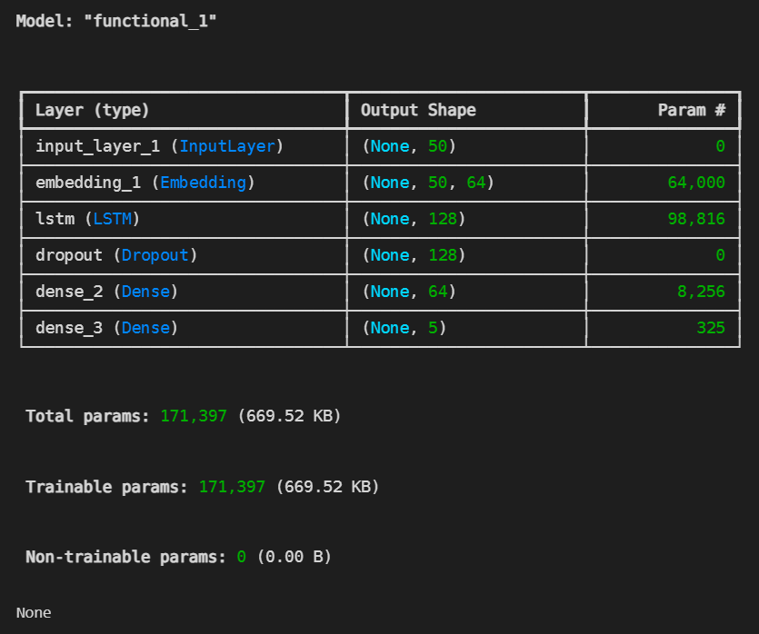
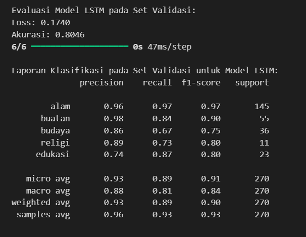
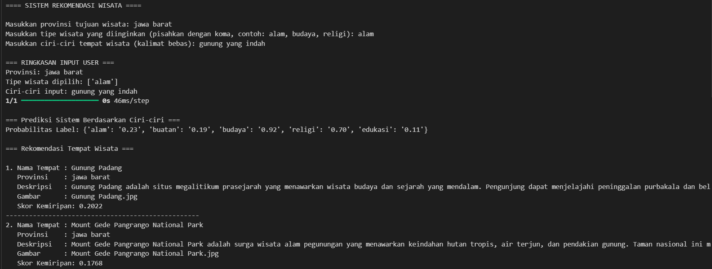

# Capstone Project Tim CC25-CF102

# Project Overview

## Latar Belakang

Pulau Jawa memiliki banyak tempat wisata yang menarik, namun banyak wisatawan mengalami kesulitan dalam menentukan tempat wisata yang sesuai dengan minat atau preferensinya. Oleh karena itu, dibutuhkan sistem rekomendasi yang mampu memberikan saran destinasi wisata yang relevan berdasarkan deskripsi dan karakteristik tiap tempat.

## Pentingnya Proyek

Dengan adanya sistem rekomendasi berbasis konten, pengguna dapat memperoleh informasi tempat wisata yang relevan dengan cepat. Proyek ini dapat mendukung sektor pariwisata dalam meningkatkan keterjangkauan informasi destinasi serta mempersonalisasi pengalaman wisata pengguna.

## Referensi

- Ricci, Rokach, & Shapira (2015). Recommender Systems Handbook.

- Dataset: Kaggle, (https://www.kaggle.com/datasets/masdarulrizqi/tourism-data-on-javaklklddsc)

# Business Understanding

## Problem Statements

1. Bagaimana cara sistem menemukan tempat wisata yang relevan berdasarkan deskripsi dan informasi tempat yang mirip?

2. Bagaimana cara meningkatkan akurasi rekomendasi tempat wisata tanpa data interaksi pengguna?

## Goals

1. Membangun sistem rekomendasi tempat wisata berdasarkan kesamaan konten (deskripsi).

2. Memberikan rekomendasi Top-N tempat wisata yang mirip dengan tempat yang dicari pengguna.

## Solution Statements

- Sistem akan menggunakan Content-Based Filtering dengan pendekatan TF-IDF pada kolom deskripsi dan cosine similarity untuk menemukan tempat wisata yang mirip.

- Pendekatan ini tidak membutuhkan data historis pengguna, cocok untuk sistem dengan pengguna baru.

# Data Understanding

Proyek ini menggunakan dataset yang tersedia di Kaggle:

🔗 https://www.kaggle.com/datasets/masdarulrizqi/tourism-data-on-javaklklddsc

## Informasi Dataset

java.xlsx: memiliki 868 baris dan memiliki 9 kolom. 

## Exploratory Data Analysis

## Variabel-Variabel pada Dataset

1. `no` - nomor urut
2. `place_name` - nama tempat wisata
3. `deskripsi` - deskripsi singkat mengenai tempat wisata
4. `review_link` - link ulasan
5. `rating` - nilai rating (0-5)
6. `total_reviews` - jumlah total ulasan
7. `address` - alamat lengkap
8. `city` - kota lokasi wisata
9. `province` - provinsi lokasi wisata

# Data Preparation

# TOKENIZER & SEQUENCE PREPARATION

Pada tahap ini mempersiapkan data teks dengan mengubah deskripsi tempat wisata menjadi urutan angka menggunakan Tokenizer dan membatasi jumlah kata hingga 1000 kata yang paling sering muncul. Kemudian, urutan angka tersebut dipadatkan agar memiliki panjang yang konsisten, yaitu 50 kata, sehingga siap digunakan dalam pelatihan model machine learning. 

# Split train-val (simple split)

Pada tahap ini yaitu membagi data menjadi dua bagian: data pelatihan (train) dan data validasi (val). 80% dari data digunakan untuk pelatihan (x_train, y_train), sementara 20% sisanya digunakan untuk validasi (x_val, y_val).

# Modeling

# Model Building (LSTM)

Menghasilkan output: 

Pada tahap ini yaitu membangun model LSTM untuk klasifikasi teks dengan input berupa deskripsi tempat wisata. Model dimulai dengan embedding layer untuk representasi kata, dilanjutkan dengan LSTM layer untuk memproses urutan teks, dan dropout layer untuk mencegah overfitting. Kemudian, dense layer diikuti dengan output layer yang menggunakan fungsi aktivasi sigmoid untuk memprediksi 5 kategori tipe wisata. Model dikompilasi dengan binary crossentropy dan adam optimizer, serta menggunakan accuracy sebagai metrik evaluasi.

# Training (MODIFIKASI)

Pada tahapan training ini yaitu melatih model LSTM dengan early stopping untuk menghentikan pelatihan jika val_loss tidak membaik selama 3 epoch. Pelatihan dilakukan selama 10 epoch dengan batch size 16, menggunakan data validasi untuk evaluasi.

# Evaluation

Menghasilkan output: 

Yang dimana mengevaluasi model LSTM pada data validasi dengan menghitung loss dan akurasi, lalu mengonversi prediksi probabilitas menjadi prediksi biner. Laporan klasifikasi kemudian ditampilkan untuk masing-masing kategori tipe wisata, memberikan metrik seperti precision, recall, dan f1-score.

# Memprediksi label dari input user 

Tahapan ini mendefinisikan fungsi predict_labels yang mengubah input teks menjadi urutan angka, memprediksi probabilitas dengan model LSTM, dan mengonversinya menjadi prediksi biner menggunakan ambang batas 0.5. Fungsi ini mengembalikan hasil prediksi dalam bentuk biner dan probabilitas untuk setiap tipe wisata.

# Rekomendasi berbasis similarity dengan threshold

Untuk tahapan ini yaitu mendefinisikan fungsi recommend_places yang memberikan rekomendasi tempat wisata berdasarkan kemiripan deskripsi dengan input pengguna. Fungsi ini memfilter data berdasarkan provinsi dan tipe wisata, lalu menghitung cosine similarity antara deskripsi input dan dataset. Tempat dengan skor kemiripan di atas threshold akan dikembalikan sebagai rekomendasi. Jika tidak ada tempat yang cocok, pesan yang sesuai akan ditampilkan.

# Interaksi user (input langsung)

Menghasilkan output:

Dari tahapan ini memungkinkan pengguna untuk memasukkan provinsi, tipe wisata, dan deskripsi tempat wisata. Sistem kemudian memvalidasi input, memprediksi tipe wisata berdasarkan deskripsi, dan memberikan rekomendasi tempat wisata yang sesuai dengan provinsi dan tipe yang dipilih. Hasil rekomendasi mencakup nama tempat, provinsi, deskripsi, gambar, dan skor kemiripan.

# Evaluasi Terhadap Business Understanding

-  Kesesuaian dengan Problem Statements

1. Menemukan Tempat Wisata yang Relevan
Sistem berhasil merekomendasikan tempat wisata yang relevan berdasarkan kemiripan deskripsi menggunakan teknik TF-IDF dan cosine similarity. Saat pengguna memberikan deskripsi tempat yang diinginkan, sistem mampu mengembalikan daftar tempat wisata yang memiliki kemiripan kata kunci dan konteks dengan input tersebut. Ini membuktikan bahwa sistem dapat menyelesaikan masalah utama yaitu menemukan tempat wisata yang mirip berdasarkan konten.

2. Tanpa Data Interaksi Pengguna
Sistem tidak menggunakan data historis pengguna (seperti rating, klik, atau histori kunjungan). Oleh karena itu, sistem cocok untuk cold-start user (pengguna baru), menjawab kebutuhan untuk memberikan rekomendasi akurat tanpa ketergantungan pada data interaksi. Hal ini sesuai dengan tantangan kedua dalam problem statement.

-  Kesesuaian dengan Goals

1. Sistem Berbasis Kesamaan Konten
Sistem yang dibangun sepenuhnya berbasis konten (Content-Based Filtering), dengan input utama berupa deskripsi tempat wisata. Proses vektorisasi dengan TF-IDF dan perhitungan similarity berhasil membangun pondasi rekomendasi berdasarkan kemiripan teks, sesuai dengan goal utama.

2. Rekomendasi Top-N
Fungsi recommend_places() berhasil mengembalikan Top-N destinasi wisata dengan skor similarity tertinggi. Pengujian juga menunjukkan bahwa hasilnya konsisten dan sesuai konteks dari input pengguna, menunjukkan bahwa tujuan sistem tercapai.

- Validasi terhadap Solution Statements

1. Penggunaan TF-IDF sebagai representasi teks dan cosine similarity sebagai metode pengukuran kemiripan berhasil diterapkan dan bekerja efektif dalam konteks data destinasi wisata.

2. Karena tidak memerlukan data pengguna, sistem ini dapat langsung digunakan dalam berbagai skenario awal, terutama di sistem atau aplikasi baru yang belum memiliki data pengguna aktif. Hal ini mendukung solusi yang dicetuskan di awal.

Kesimpulan yang di dapat yaitu Sistem rekomendasi yang dikembangkan telah sepenuhnya selaras dengan pemahaman bisnis dan berhasil menjawab permasalahan utama yang diajukan. Tanpa memerlukan data interaksi pengguna, sistem mampu menyarankan tempat wisata yang relevan dan sesuai dengan deskripsi input pengguna. Dengan demikian, pendekatan berbasis konten yang digunakan dalam proyek ini efektif dan aplikatif untuk mendukung kebutuhan industri pariwisata berbasis digital.

# Kesimpulan

Proyek ini berhasil membangun sistem rekomendasi tempat wisata di Pulau Jawa menggunakan pendekatan Content-Based Filtering. Dengan memanfaatkan deskripsi tempat dan cosine similarity, sistem mampu memberikan rekomendasi yang relevan dan informatif. Pendekatan ini sangat cocok untuk sistem yang belum memiliki data interaksi pengguna, serta memberikan dasar awal yang kuat untuk pengembangan lebih lanjut menggunakan teknik hybrid atau collaborative filtering.

